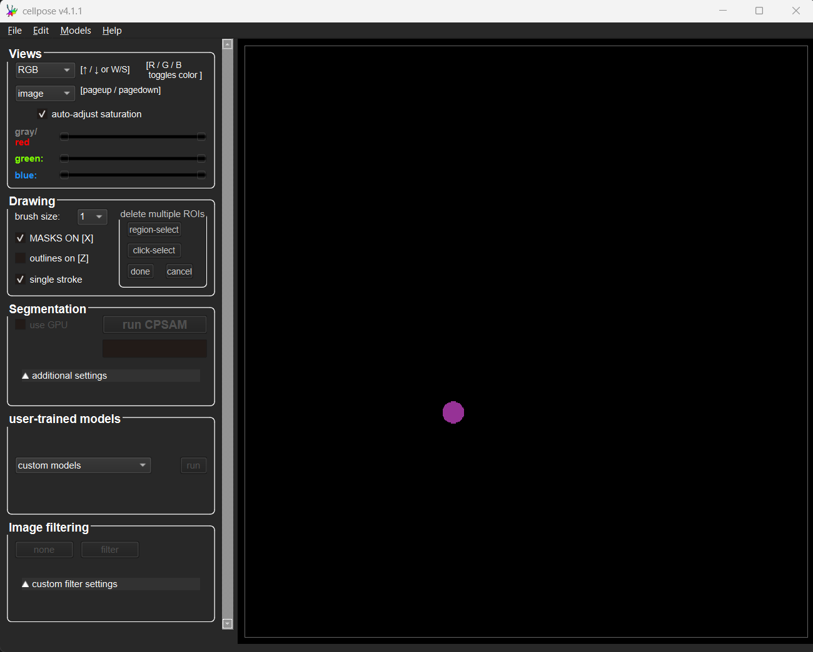

# Deep Learning for Microscopy Image Analysis

*Lab authors: Damian Dalle Nogare, Florian Jug, and Beth Cimini* . 

<small>This file last updated 2025-04-03.</small>

---

## Learning Objectives

- Appreciate how Neural Networks are trained
- Segmentation with Cellpose{cite}`Stringer2024-gd`
- Learn how to make your own `conda` environment and install packages from `pip`
- Denoising with CAREamics in python
- Bonus: Try in-browser classification with Piximi
- Bonus: Use Noise2Void in Fiji
- Bonus: Segmentation with StarDist in “Zero”

**Lab Data** in [this folder](https://tinyurl.com/QI2025AnalysisLabData) (DL4MIA)

Remember to **unzip** the data folder after downloading.

## **Overview**

Neural networks can do useful things. Their deployment within
user-friendly tools is, unfortunately, lagging behind. Hence, methods we
would like to apply to our data are not always available in Fiji or ilastik{cite}`Berg2019-no`
quite yet (or only with a fair amount of command line work and difficulty). The latest methods can only be used by the ones “brave”
enough to expose themselves to some amount of computer source code...

Today we will all be brave! 😊

We're very much looking forward to hearing about your successes and
struggles tomorrow during the Q&A session. Now, please take a seat, open
a browser, and buckle up!

## **Exercise 1: Remind yourself about what we’ve heard in the lecture**

1.  Visit
    [this neural network playground](https://playground.tensorflow.org)
    and look around. What terms did you hear before, what is new, and
    what is confusing?

2.  Please try to:

    a.  On the classification example that looks like a tiny
        checkerboard, try to get a test loss of 0.001 or less.  
        

    b.  For the spiral-shaped classification example, try to find a
        network architecture with the smallest amount of nodes (neurons)
        that will drop below 0.01 (1%) test error.  
        
        

    c.  Now switch from ‘Classification’ to ‘Regression’. What is going
        on here? Can you figure out how regression is different from
        classification?  
        

    d.  Some other things to try if you feel it…

    - Add some noise to your data. What changes? Why?

    - Try to find a setup that overfits. How do you identify overfitting?

      

    e.  All the important terms and concepts wrt. to training and
        validation are somewhere on this one page. Check if there is
        anything that makes no sense to you and ask us

## **Exercise 2: Play with Cellpose** 

```{note}
Once back home, you will need [this installation instructions](https://cellpose.readthedocs.io/en/latest/installation.html) to get started with Cellpose.
```

```{margin} Want to learn more about working with Cellpose?
Check out the [documentation](https://cellpose.readthedocs.io/en/latest/), or check them out on [the image.sc forum!](https://forum.image.sc/tag/Cellpose)
```

Here, at QI, we have taken this annoying step for you already. Hence,
you will find Cellpose pre-installed on the lab computers. To start it,
go to the Windows search next to the start menu, and type `miniforge`.
Pick and start the option `miniforge prompt`.

Once this is opened, type in those two lines:
```{warning}
Only copy the stuff after “**\>**”
```

```  
           > conda activate cellpose  
(cellpose) > cellpose
```

You should now see something like
this:

Open the file `001_img.tif` by dragging it onto the open window.
You can find this file in the `DL4MIA/easy` folder in the [Lab Data share](https://tinyurl.com/QI2025AnalysisLabData).

Like we did in the 3D lab yesterday, we need to tell cellpose (roughly) how large our objects are (you can do
so via the `cell diameter`) field. 

How might we estimate this? Keep in
mind that this diameter must be reported in pixels.

You can now segment this image by selecting one of the pre-trained
models from within the `dataset-specific models` box. Try segmenting this image using the `cyto2` model. How good are the results?

```{tip}
You can toggle the visibility of segmentation masks on and off
by hitting ‘**x**’ on your keyboard. Similarly, you can toggle cell
outlines with the keyboard shortcut ‘**z**’. Alternatively you can do so
in the `Drawing` box on the menu to the left.
```

How well did Cellpose segment your image? Where (if anywhere) did it
fail? Try some of the different dataset-specific models. Do any of these
work better? Worse? Why might that be?

Let’s now try some more challenging data. From
the `DL4MIA` folder in the [lab data share](https://tinyurl.com/QI2025AnalysisLabData), download the entire folder
named `hard`, and place it somewhere convenient (like the Desktop).

From within this folder, open the `test` folder and drag the file
`test_img.tif` to Cellpose to open it. Try segmenting it as well as
possible. Can you find setting and a model that work perfectly?

Spoiler, none of the models are perfectly suited to this data, but we
can iteratively retrain a custom model that will work better on this specific kind of data from within the Cellpose GUI…

Interested? Ok, let’s do it! 🙂

### Human-in-the-loop retraining

In the `hard` folder you downloaded earlier you will find a folder called
`train`. In this folder you will find a number of images. Open the image
`104_img.tif` in Cellpose. 

Note that we are **not** going to train a model
from scratch, instead we are going to finetune one of the existing
models (ideally starting from one that does a pretty good job already).

```{margin}
Human-in-the-loop training scheme in the Cellpose GUI:
* Segment an image using a model of your choice
* Correct segmentation errors manually
* Use the corrected image to retrain the original model
* Apply the retrained model on another (similar) image
* Correct segmentation erros (hopefully there are fewer this time!)
* Further retrain your model 
* Repeat this steps until the results are ['good enough'](https://carpenter-singh-lab.broadinstitute.org/blog/when-to-say-good-enough) for your analysis needs.
* Test your model on unseen data to evaluate generalizability!
```

Choose the model that you think gave you the best segmentations in the
previous part of this exercise and apply it to this image.
Because we want to re-train our own model, we need to provide it with `ground truth data`. In this case, this means showing it what kind of segmentation we would like to see, given the current image.
So, we need to manually curate the automatic segmentation provided by the model.

You can see now how starting from an already kind-of-good model will make the manual correction easier and faster.

You can correct the segmentation errors by
removing, adding or redrawing some of the segmentation masks. The corrected image can then
be used to further finetune (retrain) the model.

To correct errors in the segmentation:

1)  Delete a mask by holding down the ‘control’ key and clicking on it.

and/or

2)  Draw a new mask by right-clicking anywhere in the image and tracing
    an outline, ending where you began to draw.

Try correcting some of the segmentations. It might be easier if you
switch between masks and outlines (use the ‘z’ and ‘x’ keys as explained before).

Once you are happy with your corrected masks, take a look in the folder
containing all of the training images. You will notice there is a new
file there, called ‘hard\train\104_img_seg.npy’. This contains your
corrected segmentation and will become a new bit of ground truth used
during finetuning the model. But… how do you start this finetuning step?

In the Cellpose menu bar, go to `models →  
train new model with images and masks in folder`.

You should see a window like this one:


First, we need to select which initial model to use. In the screenshot
above, we are retraining the `cyto` model (but of course you may choose
to retrain any available model). You can, and should, give your new
model a name. You can also see which (corrected) images you are going to
retrain the model on under ‘filenames’, and the number of masks that
will be used for retraining in that image. Click OK whenever you are
ready to retrain and finetune the selected model!

During training you should see something like the following if you check the 
console (where you started Cellpose from). What is going on here? Remember 
back the lecture when we discussed training steps and epochs.


Once done, Cellpose will automatically open the next image in the folder and use the freshly finetuned model to segment it. 

```{note}
In Cellpose 3 there seems to be a bug where the new model is not being used to segment
the newly loaded image. If you notice the segmentation isn't very good, manually 
select your newly trained model under the "other models" dropdown and run it.
```

You can now repeat this process as often as needed. Cellpose will in each iteration
finetune the same original model, but will do so with an ever increasing
number of user labeled masks (the ones you have created). Eventually you
will either loose hope or find that Cellpose’s prediction become good
enough for you to be 😻!

Once you are happy with the results you are getting, apply your final
model to the test data we have segmented at the start of the exercise
(importantly: your model has not previously seen this image during
finetuning! Why is this important again?). Is the result better than
with the initial model you started with?

### Using the image restoration functions

The version of Cellpose that we are using (Cellpose 3) also has some ability to restore images by denoising and deblurring.
This is used to aid the segmentation of noisy data. Let's  test it!

From the folder you downloaded earlier, open the "noisy" folder and open "convollaria.tif"
in Cellpose.

Try using the Cyto3 model to segment this image (you can leave the diameter at 30 pixels).

Not a very satisfying result is it?

This is partially because the data is very noisy. Let's try to add some denoising befre we segment.

Under `Image restoration` box in the lower part of the menu to the left, press the `Denoise` button. What do you notice about the image?

Try using the same parameters and mode to segment this image. Did it improve?

Try some other restoration modes. Try using some custom filters and see if you can improve the 
segmentation. What might be useful for denoising this image?


````{tip}
Want to use Cellpose when you get home, but having trouble with the `conda` installation? You have (at least) a couple of potential options!

```{note}
As of April of 2024, both of these are still using Cellpose 2, which does have human-in-the-loop retraining but not denoising or image restoration
```

- EMBL has the Bioimage ANalysis Desktop (BAND) program, which allows you to check out virtual machines in the cloud. You simply visit a website, tell them the resources you need, and get a machine with [>20 helpful image analysis tools pre-installed](https://bandv1.denbi.uni-tuebingen.de/#/eosc-landingpage). 
  - **Upsides**: No installation, everything is correctly configured and ready to go, simulataneous access to lots of tools at once, you can ask for machines with GPUs
  - **Downsides**: They have limited capacity and sometimes machines aren't available due to EMBL courses. You have to upload your data to their servers, and download your results from them. 
- Cellpose can be used with CellProfiler, both in Python if you have both programs `pip` or `conda` installed, but [CellProfiler also offers a way to use a pre-built version using Docker](https://plugins.cellprofiler.org/using_plugins.html?installing-plugins-with-dependencies-using-cellprofiler-from-source#using-docker-to-bypass-installation-requirements) {cite}`Weisbart2023-kc`
  - **Upsides**: You can use Cellpose models without ever touching your terminal, and while keeping your data local - you only need to install CellProfiler and Docker `.app` or `.exe` files from their respective websites, download [the plugin](https://github.com/CellProfiler/CellProfiler-plugins/blob/master/active_plugins/runcellpose.py), and then point CellProfiler at the location of the downloaded file. 
  - **Downsides**: this only lets you run pre-trained Cellpose models, not train your own. Running Cellpose in CellProfiler via Docker is also MUCH slower than running it when installed via Python (though it will mostly be compute time, rather than human time, once you're in analysis mode and running all your images unsupervised). You're limited to the hardware you have locally.

````

## **Exercise 3: Denoising with CAREamics**

## Installing CAREamics

In previous exercises, we've given you a pre-made environment with the appropriate software packages (_i.e._ Cellpose) already installed. When you go to use a new tool once you leave QI, however, you won't have this option. So, let's install CAREamics from scratch!

The documentation for CAREamics can be found [here](https://careamics.github.io/0.1/). 

If you are familiar with `conda` and `pip`, the installation instructions can be found [here](https://careamics.github.io/0.1/installation/). If you are comfortable with what is there, go ahead and follow the instructions. Otherwise we will go through each step here. Keep in mind that the CAREamics instructions use `mamba`, whereas we will use `conda`. If that doesn't make sense to you, then read on to the next section!

The first step in installing a python-based software package is to make what is called an `environment`. You can think of a `package` as a particular software tool (_i.e._, CAREamics is a python `package`). An `environment` is a particular (separate) place on your computer where we can install `packages` and have them be isolated from the other environments we might also need for other purposes. We do this because different python packages require different 'dependencies' (_i.e._ other pieces of software that the package requires in order to run). So a certain package might 'depend' on a specific version of another package, for example:

Package A --> requires Package B, version 1.0

Package C --> requires Package B, version 2.0

In this case we cannot install package A and C in the same environment, because they will interfere with each other by each requiring a different vesion of package B. Unfortunatley, solving issues like this (commonly referred to as `dependency hell`) is an unavoidable part of working with bleeding-edge python software packages.

However, we will not (hopefully!) run into dependency hell today. Let's start by creating an environment. 

Open a new terminal by opening `miniforge prompt`. If you're using an existing terminal, make sure you deactivate any current environments that are open by typing `conda deactivate`.

Make a new environment by typing:

> `conda create -n careamics python=3.10`

You will be prompted to approve of all the software packages that need to be installed:

>`Proceed ([y]/n)?`

Enter `y` (yes) to proceed.

```{note}
**What are we doing here?** 
Well we are asking a particular piece of software called a package manager (in this case, `conda`, although in the CAREamics installation instructions, they use a related but slightly different package manager called `mamba`) to `create` a new enviroment with the name 'careamics' (specified by the part `-n careamics`) and telling it to pre-install python version 3.10 into that environment. 
```

Activate the environment by typing: 

> `conda activate careamics` 

As we saw yesterday and earier today, the prompt should change from `(base)` to `(careamics)`. We are now 'inside' this environment. Anything we will install will be restricted to this environment (and, thus not accesible to software outside of that environment).

Now, we need to install some packages that will allow us to use the GPU for the computations we will conduct. Remember that in deep learning, it is advantageous to run computation on the GPU as they contain specialized hardware to do very fast matrix multiplications -- exacty the kind of thing that deep learning needs a lot of! 

CAREamics is a deep learning package built around [PyTorch](https://pytorch.org), an open-source deep learning framework made by Meta and openly shared with all of us (thank you Meta!). Installation instructions can be found [here](https://pytorch.org/get-started/locally/) -- be careful here to match the particular version to our computer specifications (specifically, the version of our GPU drivers). Spoiler: we need to install pytorch using the following command:

> `pip3 install torch torchvision torchaudio --index-url https://download.pytorch.org/whl/cu124`

We can confirm that this step worked and we can see the GPU, by typing the following command:

> `python -c "import torch; print([torch.cuda.get_device_properties(i) for i in range(torch.cuda.device_count())])"`

After running this, you should see an output that lists the type of GPU we have (in this case an Nvidia Geforce 1080 Ti).

Finally, we are ready to install CAREamics! We can do this by typing:

> `pip install "careamics[examples]"`

This will use `pip`, a package installer, to install the CAREamics library.

## Using CAREamics in a Jupyter Notebook

- We will use CAREamics via a Jupter Notebook. Jupyter notebooks are interactive python notebook where we can mix text and code, and they can be run in a browser window. We have provided a notebook in the data folder which we will use. First, we need to place this notebook somewhere where we can/want to use it. Note your terminal window should say something like `(careamics) C:\Users\Admin`. This means that our prompt is currently 'active' in the folder `C:\Users\Admin`. From the place you downloaded the sample data to, copy the file `careamics.ipynb` into this folder (or any other folder you feel good about). Now go back to the terminal, move to that folder using the `cd <folder>` command (if you choose something other than `C:\Users\Admin` to copy the notebook to) and start jupyter by typing `jupyter notebook` and pressing enter. 

You should see a window with a list of all the files in the folder you started Jupyter Notebook in. Find the file you just copied into this folder (`careamics.ipynb`) and click on it. The notebook will open in a tab in your browser. Instructions on how to run CAREamics are contained within this notebook. Follow along with the notebook, but try to understand what is going on at each step! If you are confused, ask! If some problem arises, ask! If all works and you are done -- brag a little! 😸

## **Bonus Exercise: Classifying images in the browser with Piximi**

[Piximi](piximi.app) {cite}`Moser2024-vt` is a web app currently in development for training and running deep learning models in your web browser. Under most circumstances (with Cellpose as the major exception), all compute happens locally - you load your images into your web browser, but they are NOT sent to the internet, they stay locally on your machine. While this has some disadvantages (namely, that you're limited to the resources on your own machine), this means you get the benefit of web applications (namely, no need to install anything) but don't have to worry about upload times or where in the cloud your data is stored.

```{margin} Want to learn more about working with Piximi?
Check out the [documentation](https://documentation.piximi.app/intro.html), or check them out on [the image.sc forum!](https://forum.image.sc/tag/Piximi)
```

Piximi includes 4 major functionalities. Three major ones you're used to thinking about are:
* **Segmentation and Object Detection**
* **Classification**, and
* **Measurement** 

In order to train deep learning models for object detection and segmentation, it also includes a 4th major component - an **Annotation** tool. 

```{margin}
We hope to provide *trainable* segmentation options by the end of 2025. You can keep visiting [piximi.app](https://piximi.app/) to see what's available!
```

### Train a 10-class classification model using MNIST

Piximi is designed for biologists but can be used on non-biological images as well. Here, we'll use 1,000 handwritten digits from the classic [MNIST dataset](https://en.wikipedia.org/wiki/MNIST_database) {cite}`726791` , which consists of cropped images of digits from old census data and high school students.

#### Train a classifier
- Tell Piximi you want to open an example project


- Select MNIST

- Scroll through the images - you'll see that most are categorized as a particular digit, but about 60 have been intentionally left un-categorized for testing purposes.
  - Are there any categorizations you aren't sure about or disagree with?

```{tip}
You can try to use the filter tool 
on the right to inspect only one or certain categories at a time.
```

- Tell Piximi you want to fit a classifier for these images


- You will now see Piximi's training dialog; you can choose to tune some of the hyperparameters before training (though we've chosen here reasonable defaults that should work well). Otherwise, hit  to train.
- After an initialization step, you will see a performance chart that looks like the below, as well as a loss graph. You can keep hitting `Fit Classifier` to keep adding more epochs of training.

  - Are you overfitting? How can you tell?

#### Evaluate your classifier

Once you're satisfied with your training (either because it's great or because you're satisfied that it has plateaued), close the training dialog. Hit the `Evaluate Model` button to check your confusion matrix. 


```{admonition} Questions for you
What patterns of mistakes do you notice? Are they the kinds of mistakes you would expect?
```

A confusion matrix helps you figure out patterns of mistakes, but it can only tell you about the performance of your model on data for which you've already provided the answer - it can't tell you about performance in your unlabeled data. It is _critical_ then to always apply your classifier to new, unseen data to see how it performs.

```{important}
It is quadruple-extra critical when only a small fraction of your data is labeled, which is NOT true here but is often true in biological situations and you may hope will be true in your future work (after all, if you have to hand label almost all of your data, then what's the point of training a model?)
```
- Hit the `Predict Model` button to apply the model to the unlabeled data


- Evaluate the performance of the predictions - you may find that hitting one or both of these buttons helps you do that 

 


#### Fix (some?) mistakes

If and when (when), you find some errors in the predictions, you can fix them by assigning them a new category.


Depending on why you're using machine learning, you might choose to fix all the wrong images at this stage, or only some:

- Is your goal to just get the classifications right and then use them for something else, and most of them have already been correctly classified? 
  - In that case, there's no harm in just fixing the few mistakes and then moving on to other downstream quantification steps (coming soon!). 
  - If this is your goal but there are a lot of mistakes, you might not choose to fix all of them at this stage, but just fix a subset and then try to train again so you can get to a point where the errors are at a small enough level that you CAN do final data cleaning by hand

- Is your goal to create a robust, reusable classifier to use on other sets or in other contexts? 
  - In that case, you might want to fix only a subset of the mistakes before retraining, so you can get a sense of if your model performance is improving.
  - If retraining, once you've done your chosen recategorizations, clear predictions () and then hit fit again.

  ```{important} 
  If this is indeed your goal, you need to have some unseen **test** data somewhere else that you are not tuning on here! Once you've run any version of your model, at any stage, on unseen data, that data is now "seen data", and can't be used as a test set anymore. How you plan your data splits (and how much, and which, data you keep locked away as test set(s)) is critical to any kind of machine learning research
  ```

#### Save things for later

Reproducible science matters! 

You can therefore save your Piximi project file for later, as well as save your model for later use. You might find the former handy if you want to add more data later, and/or you just want to confer with someone else (including a paper reviewer, or future you) about how difficult data points were handled.


### Train a 3-class classification model on U2OS cells

```{note}
Sometimes this data set takes a long time to load, sometimes it doesn't! We're not sure why. Feel free to skip it if it's taking a long time and being annoying.
```

This data set is in some ways more challenging, but also shows a more biologically relevant classification scenario, alongside the ability to do more human-in-the-loop retraining since, unlike MNIST, the majority of the data is NOT already categorized for you.

- Refresh Piximi, and then load the U2OS-cells cytoplasm crops example dataset (Open \> Project \> Example Project \> Human U2OS-cells cytoplasm crops)


```{admonition} Optional: fix how the images look
You need not do this, since it can be a bit slow, but it is necessary if you want to assess the performance of the no-GFP class (and will make things much easier if you are red-green colorblind).

Piximi's current defaults are to load two-channel images as red and green, and to rescale each image min-max individually. While we work to fix those bugs, here's how you can manually set the colors to something better (and more uniform)
- Hit Ctrl+A to select all cells
- Hit "Annotate" to open the annotation viewer

- Open the channel adjustment bar on the right (), and change color mapping to better lookup tables and values. Hit "Apply to all images open in the annotator" when you're done (and then wait a couple of minutes)

```

- Some of the cells have already been labeled, what color represents the eGFP signal?

- Use human-in-the-loop classification (same procedure as in the previous exercise) to train a high-performing 3 class classifier.
How high can you get the evaluation metrics? How many rounds and how many corrected classifications does it take you to get there?

## **Bonus Exercise: Use Fiji’s Noise2Void Plugin**

In this exercise you will use a Noise2Void plugin in Fiji. You will have
to install it first.

```{margin} Want to learn more about working with Noise2Void?
Check out the [documentation](https://csbdeep.bioimagecomputing.com/tools/n2v/), or check them out on [the image.sc forum!](https://forum.image.sc/tag/Noise2Void)
```

1.  Open Fiji.

2.  Go to Help - Update… - Manage update sites, then check the CSBDeep
    update site and say Close - Apply changes.

3.  Restart Fiji.

4.  Download the DL4MIA/noisy/drosophila_noisy_2d.tif 2d+t image from the
[Lab Data Share](https://tinyurl.com/QI2025AnalysisLabData) and open it in Fiji.

5.  Start the “N2V train + predict” plugin.

6.  Figure it out… 😉

    a.  ***Please ask question at ANY time**!*

7.  If all works out ok, you will see something like…  
    

8.  The training will likely be VERY slow, but to sweeten up the wait,
    we show you a nice preview.

9.  Together with the result you also get the trained model for later
    reuse.

10. Try to use the trained model to denoise the same stack or any other image of your choosing.

    ```{tip} 
    Be sure to set the axes correctly. On the same stack, this will require you to add a third dimension which contains multiple time points. What should we use as the third axis and why is it 'B' when you use the same stack you used for training?
    ```
    
## **Bonus Exercise: Image Segmentation with StarDist (in “Zero”)**

As you heard in the lecture, [ZeroCostDL4Mic Collab
notebooks](https://github.com/HenriquesLab/ZeroCostDL4Mic/wiki) is a collection of jupyter notebooks for various image analysis tools using deep learning that run in Google Colab, taking advantage of its 'free' (albeit limited) GPU resources.

Let's try some instance segmentation notebooks! 

We suggest the
`StarDist` notebook, but if you feel adventurous, choose something else
you find most interesting in the context of your own research.


Go through the notebook you chose. And again:

**Ask questions, discuss, help each other**!

```{tip} 
Reduce the number of *epochs* to some small number to save yourself long waiting times!
```

Later today, when you are done with the exercises, you might want to re-run your favorite notebook with the suggested number of epochs.
Colab will work while you have fun on your free evening… 🙂

```{admonition} Super excited about deep learning now and want to know where to find the latest models?
The [Bioimage Model Zoo](https://bioimage.io/) {cite}`Ouyang2022-fm` contains a number of deep learning models, applications, and example data sets you can use on your own data or to train your own network. 
```
